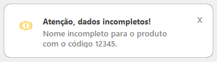
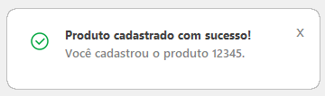
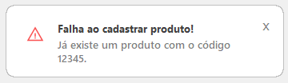

# 🖥️ Toast Notification Moderno no VB6 – Estilo Tailwind CSS  

Este projeto ensina como criar um **toast notification moderno** no **Visual Basic 6 (VB6)**, com um **design profissional** inspirado no **Tailwind CSS**.  

## 📸 **Exemplos Visuais do Toast**  

### 🔴 **Toast de Alerta**  


### ✅ **Toast de Sucesso**  


### ❌ **Toast de Erro**  


## 🚀 **Recursos do Modal**  
✅ Interface moderna e limpa 📌  
✅ Fácil de personalizar (cores, ícones) 🎨  
✅ Código simples e reutilizável 🔄  

## 📂 **Como Usar**  

1️⃣ **Baixe os arquivos do repositório**  
2️⃣ **Adicione os arquivos ao seu projeto**  
3️⃣ **Chame o toast sempre que precisar exibir uma mensagem** 
 
### **Exemplo de Uso no Formulário**  

```vb
Private Sub Command1_Click()
  MostrarNotificacao Success, "Produto cadastrado com sucesso!", "Você cadastrou o produto 12345."
End Sub

Private Sub Command2_Click()
   MostrarNotificacao Error, "Falha ao cadastrar produto!", "Já existe um produto com o código 12345."
End Sub

Private Sub Command3_Click()
   MostrarNotificacao Alert, "Atenção, dados incompletos!", "Nome incompleto para o produto com o código 12345."
End Sub
